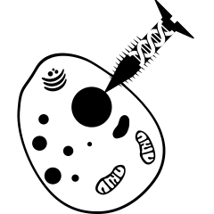

# Single Cell Reproducible Epigenomics Workflow (SCREW)

A CWL Pipeline and Docker Image for Performing Standard Single-Cell DNA Methylation Analyses



## Synopsis

Single-cell whole-genome bisulfite sequencing (SC-WGBS) is currently the most comprehensive method for investigating single-cell epigenetic regulation, with important applications for understanding stem cell differentiation and oncogenesis. However, it is a very new field, and while a handful of tools have been developed, no standard pipeline or framework for handling this data has been created, despite a number of analyses being common across the studies which have been published so far.

The purpose of this project is to provide a standardised workflow for analysing single-cell DNA methylation data. We do this by wrapping several existing tools to create Common Workflow Language modules. All modules are provided as part of an executable-anywhere Docker image. We include a small subset of toy data from single cells published by Farlik et al. 2015 (https://www.ncbi.nlm.nih.gov/geo/query/acc.cgi?acc=GSE65196). The planned, complete pipeline is viewable below and as units of the workflow are implemented and tested as CWL tools, they will be colored in.


## Installation

You can use whichever CWL runner you prefer. We tested on CWLref-runner and cwl tool.  To install them, you can use `pip`. If you do not have `pip`, you can check out `cwltool` directly from their github: https://github.com/common-workflow-language/cwltool. *NOTE* All these tools are python-2.7 branch ONLY. These tools WILL NOT work with python3+.

```
pip install cwlref-runner
pip install cwltool
```

With Docker, you don't need to install anything else.  Without Docker, you need to install all of the programs which are listed in Docker/Dockerfile.

## Setup & Usage

After all input files are formatted properly, invoke the master CWL script below:

```
cwltool SCREW.cwl
```

This will currently run through the workflow we implemented in the NCBI hackathon: 

Users should place raw single-cell methylation count data of the type stored in GEO accession GSE65196 in a working directory and be prepared for the size of the data to as much as triple during the course of the run.

